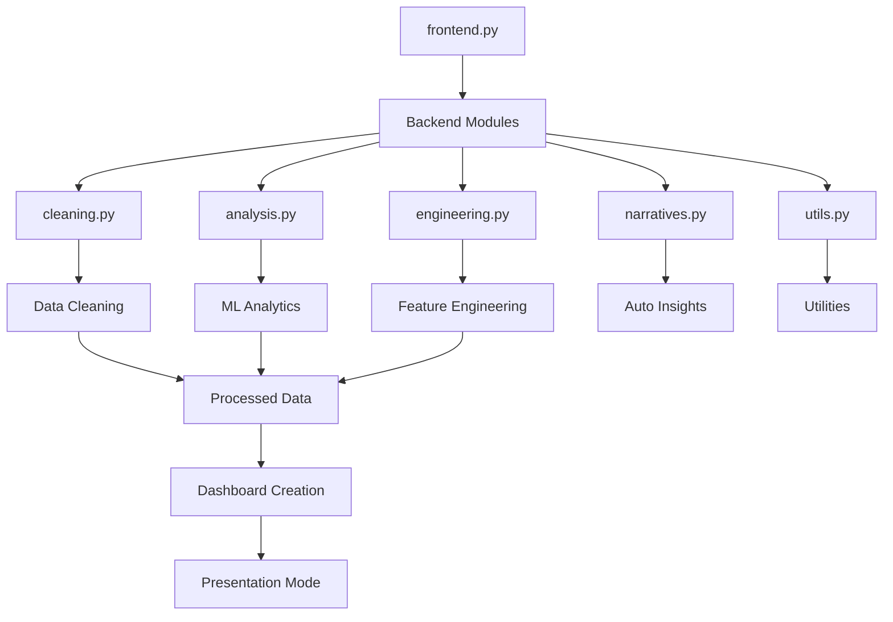
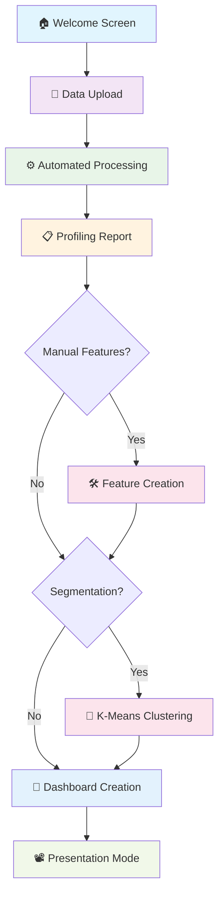
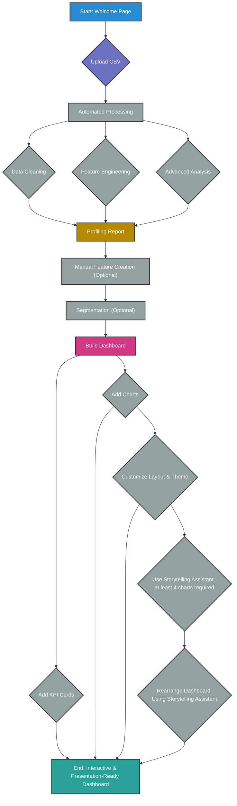

# 🚀 Advanced Business Intelligence Application

**Transform raw data into beautiful, insightful, and presentation-ready dashboards in minutes.**

A comprehensive Business Intelligence tool built with Streamlit that automates the entire data analytics workflow - from data cleaning to professional dashboard creation. This application acts as your **Automated Data Analyst Assistant**, requiring minimal technical expertise while delivering enterprise-grade analytics capabilities.

## 📋 Table of Contents

- [🌟 Key Features](#-key-features)
- [🏗️ Architecture Overview](#️-architecture-overview)
- [🚀 Quick Start Guide](#-quick-start-guide)
- [📊 Application Workflow](#-application-workflow)
- [🛠️ Detailed Feature Guide](#️-detailed-feature-guide)

## 🌟 Key Features

### 🤖 **Automated Data Processing**
- **Smart Data Cleaning**: Automatically handles missing values, removes duplicates, and eliminates useless columns
- **Intelligent Column Detection**: Identifies and converts date columns automatically
- **Data Quality Metrics**: Comprehensive logging of all cleaning operations

### 🔬 **Advanced Analytics & Machine Learning**
- **Key Driver Analysis**: Finds variables most correlated with your target metrics
- **Outlier Detection**: Uses Isolation Forest ML algorithm to identify anomalies
- **Customer Segmentation**: K-Means clustering to discover hidden data patterns
- **Correlation Analysis**: Comprehensive relationship mapping between variables

### 🛠️ **Hybrid Feature Engineering**
- **Automated Feature Creation**: Uses FeatureTools for intelligent feature generation
- **Manual Feature Builder**: Intuitive UI for domain-specific feature creation
- **Mathematical Transformations**: Log, square, square root, and statistical operations
- **Arithmetic Operations**: Create features by combining multiple columns

### 📊 **Professional Visualizations**
- **15+ Chart Types**: From basic bar charts to advanced 3D visualizations
- **Interactive Plotly Charts**: Full zoom, hover, and drill-down capabilities
- **Custom Color Schemes**: Personalized color palettes for each visualization
- **Responsive Design**: Automatic adaptation to different screen sizes

### 🎯 **Intelligent Dashboard Management**
- **Dynamic Grid Layout**: Flexible chart arrangement with automatic row management
- **KPI Cards**: Display key performance indicators prominently
- **Storytelling Assistant**: AI-powered suggestions for optimal chart ordering
- **Presentation Mode**: Professional full-screen display for presentations

### 🎨 **User Experience Excellence**
- **Guided Workflow**: Step-by-step wizard through the entire analytics process
- **Theme Customization**: Light and dark modes with professional styling
- **Multi-Resolution Support**: Optimized for HD, FHD, QHD, and 4K displays
- **Export Capabilities**: Download processed data and share dashboards

## 🏗️ Architecture Overview

### **File Structure**

Business-Intelligence-App/
├── frontend.py # Main Streamlit application
├── requirements.txt # Python dependencies
├── reademe.md # Project documentation
├── backend/ # Core processing modules
│ ├── init.py # Package initialization
│ ├── cleaning.py # Data cleaning algorithms
│ ├── analysis.py # Analytics and ML models
│ ├── engineering.py # Feature engineering tools
│ ├── narratives.py # Automated insight generation
│ └── utils.py # Utility functions
└── .devcontainer/ # Development environment
└── devcontainer.json # Container configuration

## Quick Start Guide

### **Step-by-Step Process**

#### **Step 1: Welcome Screen** 🏠
- Application introduction and feature overview
- Link to GitHub repository and documentation
- Single-click navigation to begin analysis

#### **Step 2: Data Upload** 📁
- **Supported Format**: CSV files
- **Error Handling**: Comprehensive validation and error messages
- **Preview**: Automatic data preview upon successful upload

#### **Step 3: Automated Processing** ⚙️
Three parallel processing streams:
- **Data Cleaning**: Missing value imputation, duplicate removal, column standardization
- **Analysis**: Correlation analysis, outlier detection using Isolation Forest
- **Feature Engineering**: Automated feature creation using FeatureTools

#### **Step 4: Profiling Report** 📋
Comprehensive data quality assessment:
- **Processing Metrics**: Missing values filled, duplicates removed, outliers identified
- **Automated Measures**: KPIs like "Sum of Sales", "Average Revenue"
- **Key Driver Analysis**: Interactive correlation analysis with target variable selection

#### **Step 5: Manual Feature Creation** 🛠️ *(Optional)*
Three types of custom features:
- **Arithmetic Operations**: Add, subtract, multiply, divide between columns
- **Unary Transformations**: Log, square, square root, average operations
- **Categorical Counts**: Frequency counts for categorical variables

#### **Step 6: Segmentation Choice** 🔬 *(Optional)*
- **Algorithm**: K-Means clustering with standardized features
- **Configuration**: User-selectable number of segments (2-10)
- **Output**: New "Segment" column added to dataset

#### **Step 7: Dashboard Creation** 🎨
Main dashboard building interface:
- **Chart Selection**: 15+ visualization types
- **KPI Configuration**: Up to 3 key performance indicators
- **Layout Management**: Dynamic grid system with resizable components
- **Customization**: Colors, themes, and styling options

#### **Step 8: Presentation Mode** 📽️
Professional presentation interface:
- **Full-Screen Display**: Clean, distraction-free layout
- **Professional Styling**: Optimized for presentations and meetings
- **Easy Navigation**: Simple toggle between edit and presentation modes

## 🛠️ Detailed Workflow

### Step 1: Upload Your Data

Start by uploading your dataset. The application currently supports CSV files.

### Step 2: Automated Processing & Profiling

The tool automatically cleans your data, runs an analysis, and engineers new features. You will then be presented with a **Data Profiling Report**.

- Review key metrics like missing values filled and duplicates removed.
- See which columns (if any) were identified as useless and removed.
- Explore the **Automated Measures** (like "Sum of Sales" or "Average Age") that were created.
- Use the Key Driver Analysis to select a target variable and see which features have the strongest correlation with it.

### Step 3: Manual Feature Creation (Optional)

If you have specific domain knowledge, you can create your own features.

- Perform arithmetic between two columns (e.g., `revenue - cost`).
- Apply transformations to a single column (e.g., `log(sales)`).
- Create counts based on categorical columns.

### Step 4: Segmentation (Optional)

Decide if you want to use K-Means clustering to segment your data. Simply choose the number of segments (clusters) you want to find, and the app will add a new "Segment" column to your dataset.

### Step 5: Build Your Dashboard

This is the final and most creative step.

- Use the **sidebar** to configure your dashboard.
- Select measures to display as **KPI Cards**.
- Choose a chart type, select the data for its axes, and click "**Add Chart**".
- Use the **Storytelling Assistant** to get suggestions on how to best order your charts for a compelling narrative.
- Customize colors, themes, and background.
- When you're ready, click the "Present 📽️" button to enter a clean, full-screen presentation mode.

## 🛠️ Detailed Feature Guide

This tool automates the most time-consuming steps of the data analysis workflow:

**🤖 Automated Data Cleaning**: Intelligently handles missing values by filling them with the median (for numbers) or mode (for categories/dates), removes duplicate rows, and automatically drops useless identifier-like columns (e.g., IDs, serial numbers).

**🔬 Automated Analysis**: Instantly runs a key driver analysis to find the most influential variables correlated with a target you select. It also uses a machine learning model (Isolation Forest) to flag potential outliers in your data.

**🛠️ Hybrid Feature Engineering**: Automatically creates new features using `featuretools` (e.g., `SUM`, `MULTIPLY`) and provides an intuitive UI for you to manually create custom features based on your domain knowledge. You can perform arithmetic between columns, apply transformations (log, square root), or create counts from categories.

**📈 Automated Segmentation**: Uses K-Means clustering to discover hidden customer or data segments automatically. Simply choose the number of segments, and the tool adds a new "Segment" column to your dataset.

**💡 Automated Narratives**: Generates plain-English text summaries for every chart, explaining the key insight so you don't have to. It can identify trends, correlations, and key contributors in your visualizations.

**🎨 Interactive & Customizable Dashboards**: Build beautiful, interactive dashboards with a wide variety of charts (Bar, Line, Scatter, Donut, Heatmap, and more). Customize the layout, theme, colors, and even enter a full-screen "Presentation Mode" for a clean, professional look.

**Story Teeling Assistant**: Get AI-powered suggestions on how to arrange your charts to tell a compelling story, helping you structure your presentation for maximum impact.

### **Built With**
- **[Streamlit](https://streamlit.io/)** - Web application framework
- **[Plotly](https://plotly.com/)** - Interactive visualization library
- **[Pandas](https://pandas.pydata.org/)** - Data manipulation and analysis
- **[Scikit-learn](https://scikit-learn.org/)** - Machine learning library
- **[FeatureTools](https://www.featuretools.com/)** - Automated feature engineering
- **[PyJanitor](https://pyjanitor.readthedocs.io/)** - Data cleaning utilities

### **Special Thanks**
- Streamlit community for excellent documentation and support
- Plotly team for powerful visualization capabilities
- Open source contributors who made this project possible

**Made with ❤️ by [Aseem Mehrotra](https://github.com/aseemm84)**
